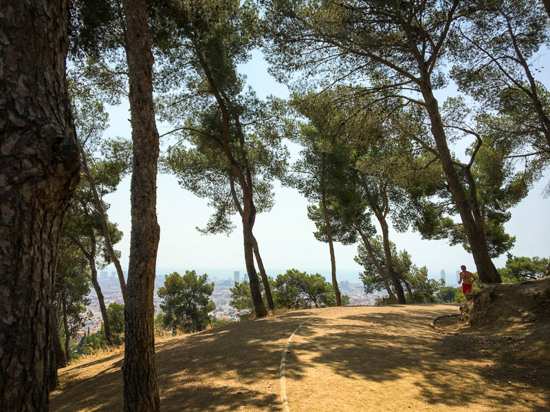
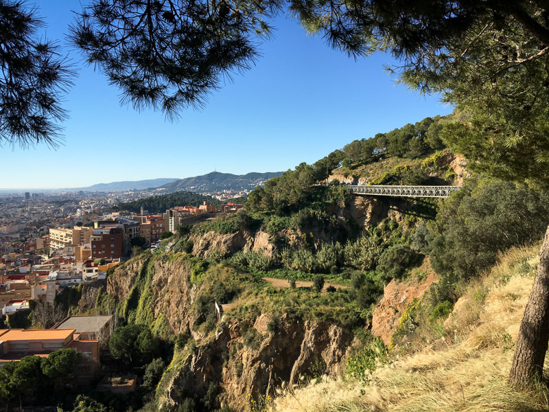
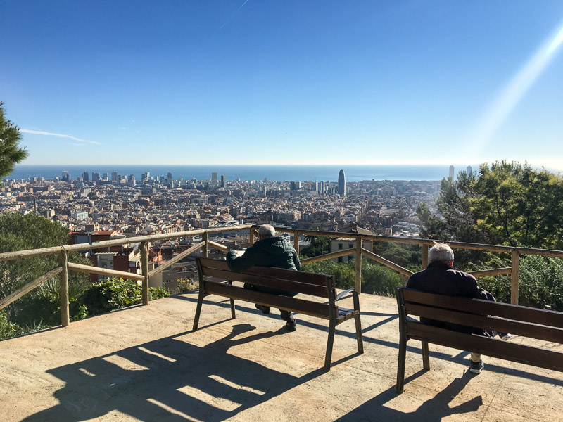
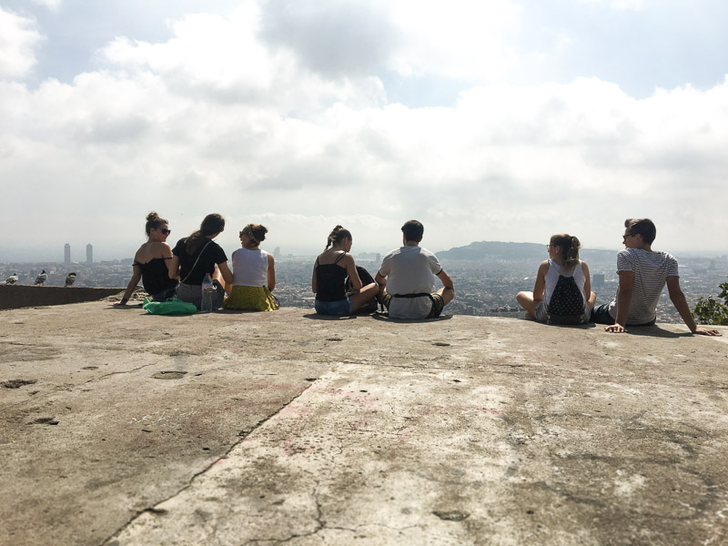
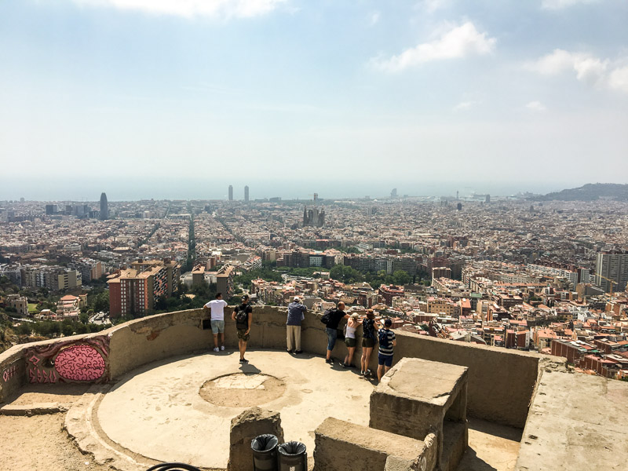
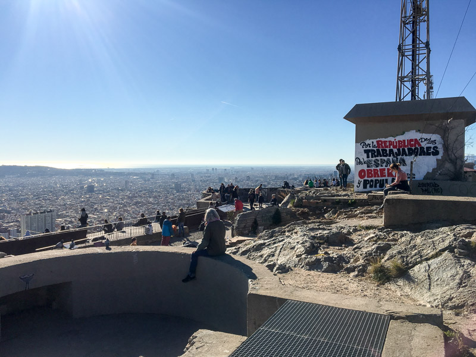
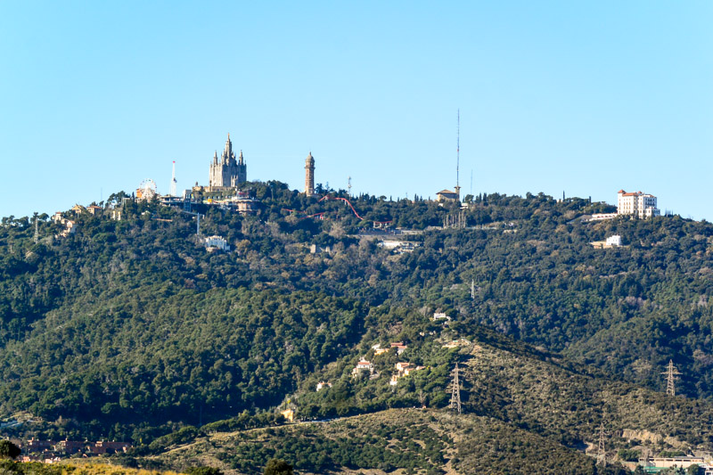

## Contents

## About the Bunkers of El Carmel

Built to defend Barcelona from aerial bombardment during the Spanish Civil War, these restored hilltop ruins today serve as a much-loved mirador with spectacular 360° views of the city.
Still unknown to most tourists, those venturing up are rewarded with a tranquillity rare among Barcelona’s most scenic spots.

The Bunkers are free to get in and open all year round, however, while they used to be accessible any time of day, 
there is now a restricted timetable as of May 2023: **9 am to 7:30 pm in summer and 9 am to 5:30 pm in winter**. <a href="http://www.bunkers.cat/en/entrance-fee" target="_blank">More info here</a>.

## The essentials
Some walking is required to reach the Bunkers as they’re perched on the top of Turó de la Rovira, a hill within Park Guinardó. Only a short walk is needed if arriving on the 119 bus, stopping at ‘Marià Lavèrnia’ – a more arduous ascent (around 10 minutes) lies in store for those who take the 92 bus to ‘Ctra. del Carmel - Mühlberg’.

The nearest metro stops are Alfonso X (L4) and El Carmel (L5), which will then require an additional 20 minutes or so by foot. The more adventurous might consider getting off at the Maragall metro station (L4 & L5) and walking via Plaça Catala through the Guinardó Park, then across the spine of the Turó de la Rovira (check a map to keep yourself on the right track).

### Guinardo Park

### Guinardo Park towards the bunkers

There isn’t much overhead cover at the Bunkers themselves, so be wary of the sun when heading up during the hotter months and consider timing your visit to coincide with the cooler hours of the day. You may also want to pack food and drink with you, as there is plenty of space for picnicking and nowhere at the bunkers themselves to buy refreshments (however, during the summer, you may find street merchants selling water and beer!)

### Guinardo Park Viewpoint

The Bunkers are typically quiet, but will naturally get busier with tourists and locals alike at weekends.

## We recommend
The Bunkers are one of the best places to watch both the sunrise to the east over the Mediterranean Sea or set behind the mountains to the west. They are the perfect vantage point to spy Montjuïc, Tibidabo, and Park Güell, as well as look down upon the magnificent Sagrada Familia.

Don’t forget to capture the stunning vistas while you’re at it – there’s never been a better time to use ‘panorama mode’ on your camera!

### Views from the Bunkers

## A little background
Affectionately known as “bunkers”, the site is in fact an anti-aircraft fortification, built by the Republican army in 1938 to defend the city against Italian bombing raids launched in support of Franco’s forces. It lay abandoned following disarmament in 1939, and the site soon developed into a shantytown with over 100 dwellings springing up there in the following decades. It was not until 1990 that the area was cleared, and only in the early 2000s was restoration undertaken to preserve the site and the memory of those who defended it.

Thanks to its relatively obscure history, the area is still off the beaten track for most travellers and is a fond favourite among locals.

## What’s nearby?

Park Güell sits next to Park Guinardó, so this must-see (with a mirador of its own) is within walking distance of The Bunkers. Give yourself about 20-30 minutes to get there by foot, or take the 24 bus from ‘Doctor Bové - Conca de Tremp’, a short walk from the Bunkers themselves.

### View of La Sagrada Familia

### View of Mount Tibidabo from the bunkers
