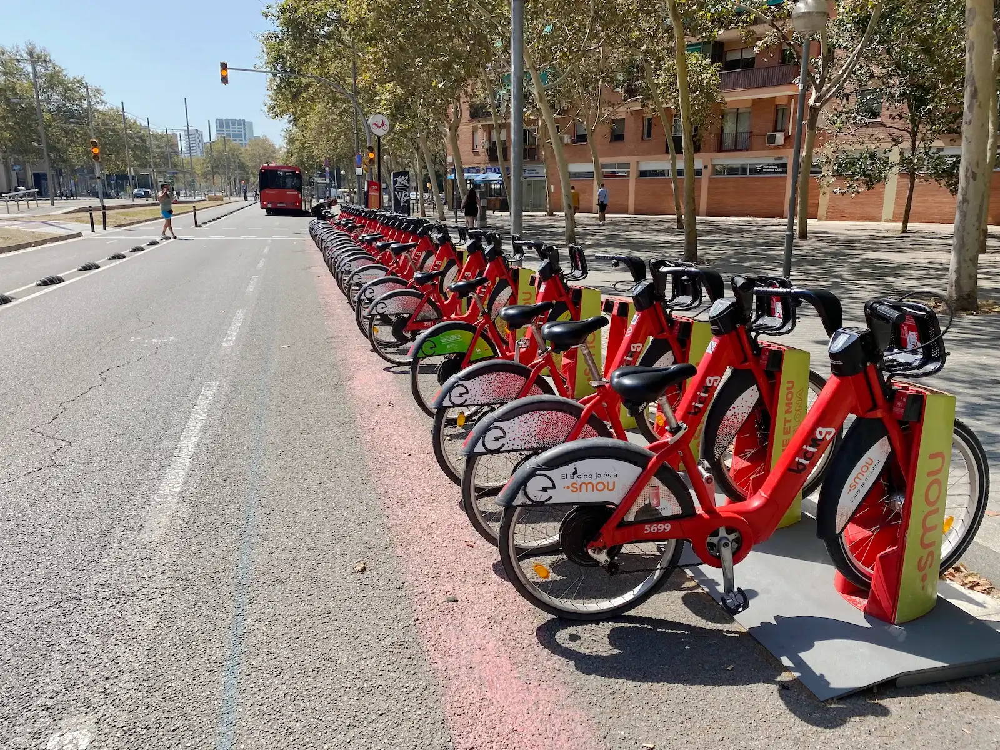
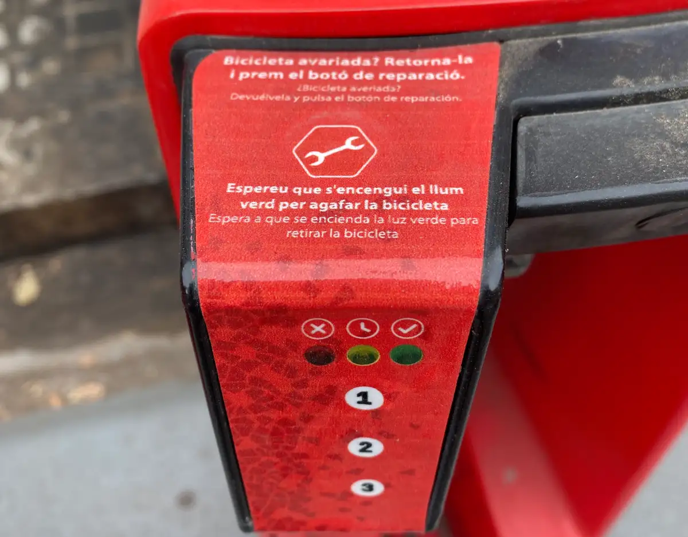

## Contents

## What is Bicing?

Bicing is a city-wide bike sharing system in Barcelona. It is intended to be used by residents of Barcelona and not aimed at tourists. Wherever you are in Barcelona, there will generally be a Bicing bike station closeby, within a few minutes' walk. In the central neighbourhoods there are bike stations on almost every other street corner.

Note: If you are not a resident of Barcelona then Bicing probably won't be useful for you, in which case checkout below these <a href="#alternatives-to-bicing">alternatives to Bicing</a> for bike, ride, moto and scooter sharing in Barcelona.

## How does Bicing work?

To use Bicing you must first signup for a subscription on the <a target="_blank" href="https://www.bicing.barcelona/">Bicing website</a>. Once you have signed up, Bicing will send you a Bicing card in the post. In the meantime you can still use Bicing via the <a href="https://www.bicing.barcelona/apps-bicing" target="_blank">Smou app</a>. You will have access to the 2 types of bikes: **Mechanical** and **Electrical**. Adults are eligible to use the service, but people who are between 16 and 18 years old will need signed authorization by their parent or legal guardian.

Note: it is possible to signup the same day that you want to use the bikes, provided you have the documents required. This can be done via the <a target="_blank" href="https://www.bicing.barcelona/">Bicing website</a> and/or **Smou** app from the App/Play stores.

## How much does Bicing cost?

Bicing costs *€50 per year (4 tariffs to choose from) and is renewed every year with a month’s notice.

- *Note: the prices update each year. <a href="https://www.bicing.barcelona/tarifes" target="_blank">2024 Bicing prices are here</a>.
- Most people that we have spoken to in Barcelona take the <a href="https://www.bicing.barcelona/tarifes" target="_blank">Flat Rate tariff on here</a>, however there are different tariffs. If you live in, or will be visiting any of the following places **as well as Barcelona**, you will want to consider the **Bicing + Ambici** tariffs:

Sant Boi de Llobregat, Sant Joan Despí, Cornellà de Llobregat, El Prat de Llobregat, Gavà, Castelldefels, Molins de Rei, Santa Coloma, Badalona or Sant Adrià de Besos.

<a href="https://www.ambici.cat/en/" target="_blank">More about Ambici here</a>.

## Things to know about Bicing

In general there are more mechanical bikes than electric bikes. If you are making a longer journey, it can be better to use an electric bike. At the time of writing, a typical 30 minute journey on a mechanical bike is free and the same journey on an electric will be €0,35, assuming you have an annual subscription to the **Flat rate** tariff.

For journeys longer than 30 minutes, you will pay an additional fee for each 30 minutes of usage, according to this table:

**Mechanical Bikes** (Based on the **Flat rate** tariff)

| Time              | Mechanical | Electrical |
| :---------------- | :--------- | :--------- |
| 0 - 30 mins       | Free        | €0,35     |
| From 30 - 60 mins | + €0,70     | + €0,90   |
| From 60 - 90 mins | + €0,70     | + €0,90   |
| From 90 - 12 mins | + €0,70     | + €0,90   |
| From 120 mins     | + €5/hour   | + €5/hour |

### Example journeys

#### Mechanical bike
- 25 minute journey: Free
- 55 minute journey: €0,70
- 1 hour 25 minute journey: €1,40
- 1 hour 55 minute journey: €2,10
- 2 hour 25 minute journey: €7,10

#### Electric bike
- 25 minute journey: €0,35
- 55 minute journey: €1,25
- 1 hour 25 minute journey: €2,15
- 1 hour 55 minute journey: €3,05
- 2 hour 25 minute journey: €8,05

### Taking out a Bicing bike
To take out a bike you will have 2 options - using the official Bicing card or using the Smou app.

If you use the card, you will need to place it against the card reader on the bike terminal (next to the front wheel).

If you use the Smou app, you will need to open the app, then scan the QR code on the bike itself thru the app.

If the bike you take out isn’t working properly, you can immediately put it back in and take out a new one. There's a 3 minute window to do the change. You can also change it more than once!

Note: sometimes the QR codes can be scratched or not readable. If this is the case, scanning it won't work but you can always enter the bike's code into the app, which should work, too!

### Returning a Bicing bike
When you return a bike to any bike station you will have to wait 10 minutes before you can take another bike out.

If the station is full, you can request an additional 10 minutes at the Bicing computer terminal at the station. This is a courtesy which allows you more time to complete your trip for no additional fee, since sometimes bike stations can be full.

If the bike you are using is faulty or needs maintenance, you can report the bike as faulty using the terminal at the station.

---

## Bicing tips & tricks
- Usually a Bicing is faster than a metro, especially for short journeys.
- The **JoTambe app** has a scoring game for Bicing enthusiasts - some stations have an incentive to take bikes out at certain times of the day.
- Before you ride, always check for flat tires and that the brakes are working properly. It doesn’t hurt to give the wheel a kick! Also check that the handle bars and grips are good.
- When you check out the bike, listen for the unlocking sound and look out for the green light on the bike stand.
- You have to wait 10 minutes before you can use the system again after you have dropped off a bike
- You can view how much the previous trip cost on the Smou app under the **Consumption** section. It also tells you the journey duration. You will find that you will be charged in batches - that is, they will take a payment from your bank <a href="https://www.bicing.barcelona/faqs-i-normes#reference2-2" target="_blank">once a week on Sundays</a> and sum up the usage for that duation.
- It is possible to use **City Mapper** app for checking bike availability. We find that it is faster at loading than the Smou app, especially for station availability, but you can't use it to checkout a bike unfortunately.
- You can reserve a bike from the Smou app and you will have 5 minutes to get to the station. You might find the reserved bike will be flashing yellow on the station panel but in theory you can take out any bike (electric or mechanical, depending on which you have reserved). Incidentally, a red light on the station panel means the bike is out of service and cannot be taken out.
- If the QR code is damaged, you can still use your Bicing card to checkout a bike.
- You cannot bike share, meaning that the bike rider must be the Bicing user. You may encounter Bicing inspectors at places such as Arc de Triumf who may ask to check your details against the bike you are using!
- For electric bikes, always check the electric power bars before riding - press the button on the bike to see the charge level.
- It's possible to cycle quite far in 30 minutes. For example, it’s possible to go across town to the edge of the network in less than 30 mins if you're quick!
- If you take out a bike, you have a 3 minute window where you can choose to check it back in and remove another one. This is in case you wish to change the bike (maybe the brakes are not working or the electric motor isn't working etc...). You can even check the second bike back in and take out a third. Each time you do this, the checkout time will restart. Note: you cannot checkout a mechanical bike and then swap it for an electric bike and vice-versa using this method, so don't get caught out!
- In general there are more electric bikes at stations above Carrer de Provença. This is because of the fact that it is uphill to reach these stations.
- During major events, some stations are always full/empty of bikes - for example, during Primavera festival. The beach stations can also get very full during summer since people drop off the bikes to go to the beach.

## Opinionated tips from a regular Bicing user on how to best use Bicing

Note: these are subjective, but if you follow this list you will have Bicing happiness!

1. First, check to see if the bike has a flat tire - it's amazing how many people check out the only electric bike thinking how lucky they were only to discover that the tire is flat, then they have to go to another station and wait 10 minutes.
2. Check to make sure that the QR code is scannable/readable (if you are using the Smou App). A lot of people only use the app and don't carry their Bicing card. If the QR isn't scannable because it has been defaced or broken, you can still manually type in the bike code (like a 10 digit alphanumeric code) provided it is legible.
3. Check to make sure that the brakes are working. It's surprising how often the back brakes don't work, or are nearly ineffective. You can do this by lifting the bike up in the dock, spinning the wheel and testing them!
4. If you are intending to check out an electric bike, it is usually the case that the newer bikes are slightly better, in terms of performance. You can tell which are newer by their handlebars. New one's have contoured plastic grips instead of the rubber grips, which comes off in your hands, especially in summer when hot! Also, the seat can usually go a bit higher on the newer bikes.
5. Next, if you intend to take out an electric bike, it's always better to go to a station where there's more than 1 electric bike available, so consider walking to the next station if this is not the case.

## Alternatives to Bicing in Barcelona
If you are a tourist just visiting Barcelona, you will probably want to checkout one of these alternative bike, scooter, moto or ride sharing schemes.

- <a href="https://www.donkey.bike/" target="_blank">Donkey Republic</a>
- <a href="https://cooltra.com/en/" target="_blank">Cooltra</a>
- <a href="https://en.rideyego.com/" target="_blank">Yego</a>
- <a href="https://movilidad.acciona.com/en_ES/barcelona/" target="_blank">Acciona</a>
- <a href="https://www.scooter-house.com/" target="_blank">Scooter House</a>
- <a href="https://bolt.eu/en-es/scooters/" target="_blank">Bolt Scooters</a>
- In addition to these, there are many places to rent a city bike for the day in El Gótico, El Born and other central neighbourhoods if you just need a bike for the day.

