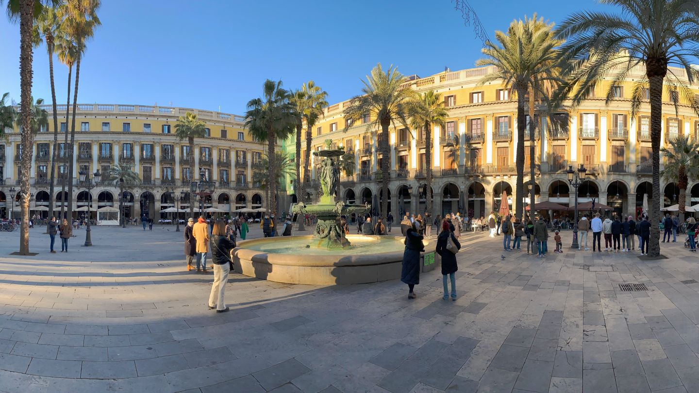

## Contents

## About Plaça Reial

Found just off Las Ramblas, dropping in to Plaça Reial is a must – day or night. It offers a huge range of restaurants and bars, with plenty of outdoor seating to watch the world go by, and is complete with a central fountain, fulsome palm trees, and lampposts designed by the famous Antoni Gaudí himself. In summer, most restaurants won’t stop serving until after midnight, and the area is well regarded for its clubs and live music.

## Where is Plaça Reial in Barcelona?

Plaça Reial is located in the Gothic Quarter and is accessed easily on foot from Las Ramblas. The closest Metro stations are Liceu and Drassanes (L3) or Jaume I (L4). It’s also walkable from Plaça de Catalunya, at the top of Las Ramblas.

The plaça is always busy but big enough to maintain a measure of tranquillity, making it a popular haunt for expats, tourists and locals alike. Depending on the time of year and the time you arrive, the plaça will be either relaxed with people taking photos by the fountain or in full swing with diners and street entertainers.

During holidays and celebrations, the square often hosts live music and other performances, and markets are often held on Sundays.

## Things to do in Plaça Reial

Visitors can savour the historic façades and the buzz of local life (many of the square’s residents have been living there for decades) by grabbing a beer, sangria or cocktail at one of the many bars. There is more than meets the eye, so be prepared to explore: plenty of nightclubs and drinking establishments are hidden from view and tucked away downstairs and in the main side-doors around the plaça.

For those looking for late night bars & clubs, you have a few options: Jamboree (dance, hip-hop, R&B), Sidecar (dance, factory club) and Karma (rock, pop, soul, blues, indie) in the immediate vicinity, all open until well after 3 am.

There are plenty of food options on the square and you can just turn up at most of the restaurants. Just to the north, the street Carrer d'Escudellers Blancs promises some hidden bars and cocktail joints: for example, First Cocktail Barcelona and Sub Rosa are often worth a visit.

We also recommend moving toward Plaça George Orwell, where you will find another busy square with bars and restaurants. For clubs and nightlife, check out Marula Cafe or Macarena Club.

Finally, three Catalan favourite restaurants amongst tourists, locals and expats are the Gothic Quarter’s oldest restaurants. 

- <a target="_blank" href="https://culleretes.com/">Can Culleretes</a> (the oldest in Barcelona since 1786)
- <a target="_blank" href="https://www.loscaracoles.es/">Los Caracoles</a> (since 1835)
- <a target="_blank" href="https://4gats.com/">4Gats</a> (since 1897)

## A little background about Plaça Reial

Once the site of a Capuchin convent dedicated to Santa Madrona, the square was constructed in 1848 in honour of King Fernando VII of Spain (hence the name, “Royal Square”). A suitably royal statue of the king on horseback was planned, but never materialised – so the “Fountain of Three Graces” which stands today, was built in its place.

It is said that the lampposts, erected in 1879 and designed by a young Antoni Gaudí, were his first public commission in the city.

## What’s nearby?

Plaça Reial is very conveniently located and a great starting point for exploring the city. In close proximity is, of course, Las Ramblas, which connects to the square via a side street.

Barcelona Cathedral is just a short walk away through the gothic streets, as is [Mercat de la Boqueria](/blog/2-visiting-boqueria-market/) – just a little further along Las Ramblas. Being in the Gothic Quarter, the square is also within walking distance of Barceloneta and the beach, with many bars, restaurants and shops to discover close by.
