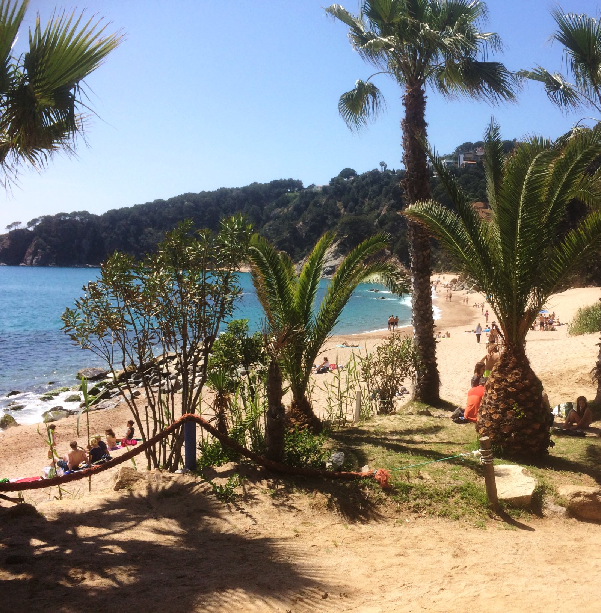

## Contents

## Visiting Cala Llorell

Although strictly not a town, Cala Llorell gets a mention due to having a large camping zone and a secluded “cala” bay and beach, which is the closest beach if you're staying at the campsite.

The cala and campsite can be reached by public transport (train to Blanes, followed by a local bus from Blanes station to outside the campsite). Then you just need to walk down to the beach but take supplies as there's nothing down there - the nearest shop is the small supermarket, which serves the campers.

## Camping at Cala Llevadó

While we are not affiliated with _Camping Cala Llevadó_ campsite, it is a cool place to stay in this area and the campsite is set on the hill in the forest above the cala, and there are different types of lodgings to choose from, from alpine chateaus to camping in tents. Here's a link to the place - [Camping Llevado](https://calallevado.com/), if you want to read more.

## Cala Llorell
It's worth a trip down to the beach if you're in the area and you'll find it very secluded and quiet but it's a steep descent. It is also possible (and very nice) to do a day walk from the camping area to Tossa de Mar, via a forest/coastal path, so be sure to check [Wikilok](https://www.wikiloc.com/) or [Komoot](https://www.komoot.com/) for an appropriate route.

[IMG gallery of cala, camping, forest route, Tossa view]
